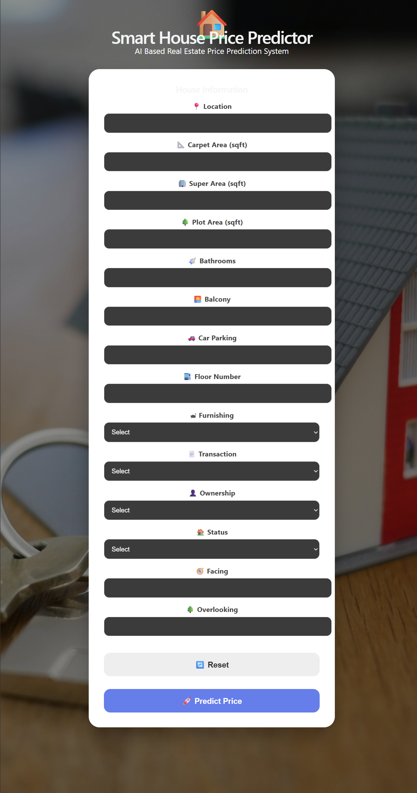
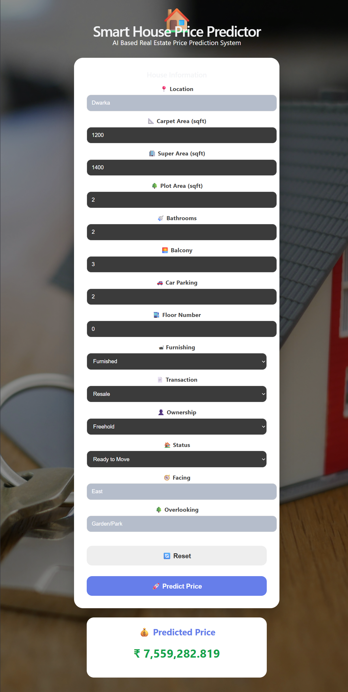

# 🏠 House Price Prediction System

## 📌 Project Overview
This project predicts house prices using Machine Learning. The user enters house details through a React web application, and the trained model predicts the estimated house price using a FastAPI backend.

---

## 🚀 Features
- Predict house prices instantly.
- User-friendly interface.
- Machine Learning model trained on real housing data.
- FastAPI REST API.
- React Frontend.
- Responsive Design.

---

## 🛠 Technologies Used

### Frontend
- React.js
- Vite
- Axios
- CSS3

### Backend
- FastAPI
- Python
- Uvicorn

### Machine Learning
- Pandas
- NumPy
- Scikit-learn
- Joblib

---

## 📂 Project Structure

HousePricePrediction/
│
├── backend/
├── frontend/
├── screenshots/
├── house_prices.csv
├── HousePricePrediction.ipynb
├── README.md
└── .gitignore

---

## ⚙️ Installation

### Clone Repository

```bash
git clone <repository_link>
```

### Backend

```bash
cd backend

pip install -r requirements.txt

uvicorn main:app --reload
```

### Frontend

```bash
cd frontend

npm install

npm run dev
```

---

## 🔗 API Endpoint

POST

```
/predict
```

Example Request

```json
{
  "location_grouped":"Delhi",
  "carpet_area_sqft":1200,
  "super_area_sqft":1400,
  "plot_area_sqft":0,
  "Bathroom":2,
  "Balcony":2,
  "Car Parking":1,
  "floor_num":3,
  "Furnishing":"Semi-Furnished",
  "Transaction":"Resale",
  "Ownership":"Freehold",
  "Status":"Ready to Move",
  "facing":"East",
  "overlooking":"Garden/Park"
}
```

---

## 📈 Machine Learning Model

Regression Model for House Price Prediction.

Evaluation Metrics

- MAE
- RMSE
- R² Score

---

## 📸 Screenshots

### Home Page



---

### Prediction Result



## 👨‍💻 Team Members

- Ahmed Ehab
- Hasnaa Ibrahim
- Mohamed Ali
- Sara Ahmed

 
**Project:** House Price Prediction using Machine Learning